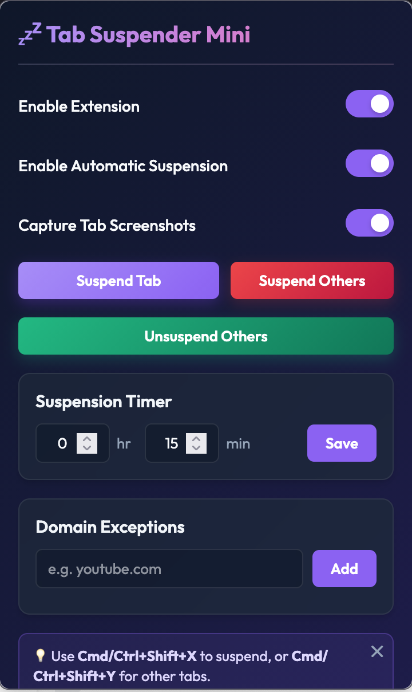

# 💤 Tab Suspender Mini

> [!WARNING]
> **Before updating the extension, unsuspend all tabs first** (Popup → **Unsuspend Others**, or click each suspended tab to restore it).
>
> Suspended tab URLs point to the old extension ID, so after an update they may fail to restore on click.

Automatically suspend inactive tabs to reduce memory and CPU usage. Lightweight, fast even with hundreds of tabs, with manual controls, screenshots, exceptions, and crash recovery.

## Screenshots

| Popup | Suspended tab |
|---|---|
|  |  |

Popup: toggles, manual suspend / unsuspend, timer, and domain exceptions. Suspended tab: blurred screenshot background, original title + URL, click anywhere to restore.

## Features

### 💤 Tab Suspension
- **Automatic suspension:** inactive tabs are suspended after a configurable delay (default: 1 minute).
- **Manual suspension from popup:**
  - **Suspend Tab** – suspend the current tab instantly
  - **Suspend Others** – suspend all other tabs in the current window
  - **Unsuspend Others** – restore all suspended tabs in the current window
- **Context menu (right-click on page / tab):**
  - Suspend This Tab
  - Suspend All Other Tabs
  - Suspend Selected Tabs (multi-select with `Ctrl`/`Cmd` + click)
- **Keyboard shortcuts:**
  - `Ctrl+Shift+X` / `Cmd+Shift+X` – suspend current tab
  - `Ctrl+Shift+Y` / `Cmd+Shift+Y` – suspend all other tabs
- **Suspended page:** shows original title and URL over a blurred screenshot, click anywhere to wake the tab.

### ⏱️ Suspension Timer
- Set delay in hours (`0–23`) + minutes (`0–59`), minimum 1 minute total.
- Change applies live – no restart, existing tabs keep aging with the new delay.

### 🎛️ Toggles
- **Enable Extension** – master on/off switch (also switches toolbar icon active/inactive).
- **Enable Automatic Suspension** – turn off auto-sweep but keep manual suspend working.
- **Capture Tab Screenshots** – save a lightweight JPEG preview shown blurred behind the suspended page. If capture fails, the tab is still suspended.

### 🛡️ Smart Protections (never suspended)
- Tabs currently playing audio (`audible`)
- Domain exceptions (normalized, matches subdomains – e.g. `youtube.com` covers `www.youtube.com`, `music.youtube.com`)
- Internal pages: `about:`, `about:blank`, `about:newtab`, `chrome:`, `moz-extension:`, and already-suspended pages

### 🧠 Crash / Restart Recovery
- Pending suspends are tracked, so an interrupted suspend can be restored from the popup under **⚠️ Recovered Lost Tabs → Restore**.
- Previously suspended tabs that were closed are re-opened automatically on startup.

### ⚡ Built for Scale
- Single 30s background sweeper – no per-tab timers
- In-memory exception cache (no storage read per tab per sweep)
- Batched suspension (max 10 per sweep, oldest first), sequential restores – stays responsive with 1000+ tabs

## Usage

1. Click the toolbar icon to open the popup.
2. Set the timer and hit **Save**.
3. Add domains you never want suspended under **Domain Exceptions**.
4. Use buttons, right-click menu, or shortcuts to suspend/unsuspend.

## Install (development)

Firefox:
1. Go to `about:debugging#/runtime/this-firefox`
2. **Load Temporary Add-on** → select `manifest.json`

Chromium (limited MV2 support):
1. Go to `chrome://extensions`, enable Developer mode
2. **Load unpacked** → select this folder
